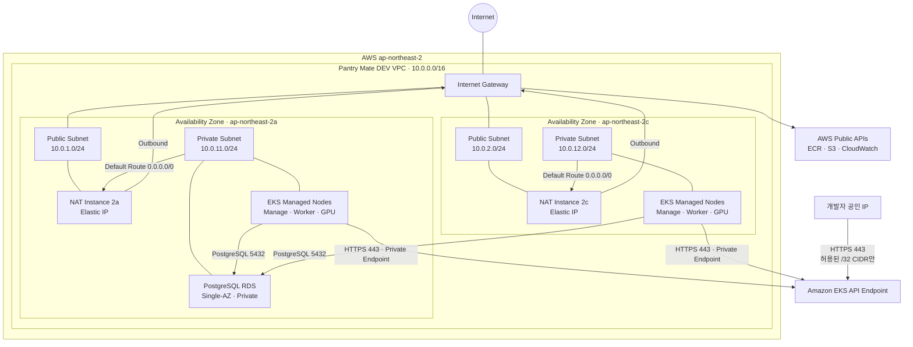

# DEV Network Architecture

Pantry Mate DEV 환경의 AWS 네트워크 구성과 주요 트래픽 흐름을 정리합니다.

이 문서는 `environments/dev/foundation`, `environments/dev/runtime`과
`modules/network`, `modules/nat-instance`, `modules/eks`, `modules/rds`의 현재
Terraform 구성을 기준으로 합니다.

## Network Flow



## Subnet 구성

| Availability Zone | Public Subnet | Private Subnet | 주요 리소스 |
| --- | --- | --- | --- |
| `ap-northeast-2a` | `10.0.1.0/24` | `10.0.11.0/24` | NAT Instance, EKS Node, RDS Primary |
| `ap-northeast-2c` | `10.0.2.0/24` | `10.0.12.0/24` | NAT Instance, EKS Node |

VPC CIDR은 `10.0.0.0/16`입니다. Public subnet은 Internet Gateway와 연결되며,
Private subnet에는 외부에서 직접 접근할 수 있는 경로가 없습니다.

## 주요 트래픽 흐름

### Private Subnet Outbound

각 Private subnet의 기본 경로는 동일 AZ의 NAT Instance를 향합니다.

```text
EKS Node 또는 Pod
  → Private Route Table
  → 동일 AZ NAT Instance
  → Internet Gateway
  → ECR, S3, CloudWatch 등 AWS Public API 또는 인터넷
```

현재 ECR, S3용 VPC Endpoint가 없으므로 해당 서비스 접근도 NAT
Instance를 통과합니다.

### EKS API 접근

- EKS private endpoint는 활성화되어 있습니다.
- EKS Node는 VPC 내부에서 HTTPS 443으로 private endpoint에 접근합니다.
- Public endpoint를 활성화한 경우 `eks_public_access_cidrs`에 등록된 개발자 CIDR만
  HTTPS 443 접근이 가능합니다.
- `0.0.0.0/0`을 개발자 접근 CIDR로 사용하면 안 됩니다.

## Security Group 요약

| 대상 | Inbound | Source |
| --- | --- | --- |
| EKS Public API | HTTPS 443 | `eks_public_access_cidrs`의 제한된 CIDR |
| NAT Instance | 전달 트래픽 | DEV Private subnet CIDR |
| PostgreSQL RDS | TCP 5432 | DEV VPC CIDR (`10.0.0.0/16`) |

RDS 규칙은 `0.0.0.0/0`을 허용하지 않습니다. 현재 VPC CIDR을 사용한 이유는 장기
유지되는 Foundation이 Runtime에서 동적으로 생성되는 EKS Security Group ID에
의존하지 않게 하기 위해서입니다. EKS module에 전용 client Security Group 연결을
지원하는 후속 작업이 완료되면 source SG 방식으로 더 좁힐 수 있습니다.

## 현재 제약사항

- 모든 EKS managed node group은 `2a`와 `2c` Private subnet을 함께 사용합니다.
- Application Load Balancer, Network Load Balancer, Ingress Controller는 현재
  Terraform 구성에 포함되어 있지 않습니다.
- NAT Gateway 대신 비용 절감을 위한 NAT Instance를 사용하므로 운영 환경에서는
  가용성, 성능, 패치 및 장애 복구 방식을 별도로 검토해야 합니다.
