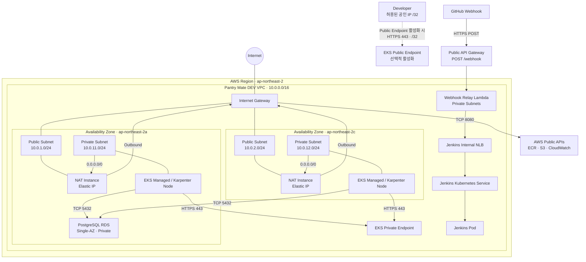

# DEV Network Architecture

Pantry Mate DEV 환경의 AWS 네트워크 구성과 주요 트래픽 흐름을 정리합니다.

본 문서의 범위는 `project04/cloud`입니다. `project04/ansible`의 `172.16.8.0/24`
기반 Kubernetes 환경은 별도 환경이므로 포함하지 않습니다.

본 문서는 다음 Terraform 구성을 기준으로 합니다.

```text
environments/dev/foundation
environments/dev/runtime
environments/dev/autoscaling

modules/network
modules/nat-instance
modules/eks
modules/rds
modules/jenkins
modules/webhook-relay
modules/argocd
modules/karpenter
modules/keda
```

`environments/dev/cloudflared`의 Kubernetes manifest는 Terraform이 직접 관리하지
않는 별도 적용 구성으로 구분합니다.

DEV 핵심 인프라는 장기간 유지하는 `foundation`과 필요할 때 생성·삭제할 수 있는
`runtime`으로 분리되며, Cluster Autoscaling 구성은 별도 `autoscaling` Root Module에서
관리합니다.

* `foundation`

  * VPC
  * Public / Private Subnet
  * Internet Gateway
  * Route Table
  * RDS DB Subnet Group
  * RDS Security Group
  * PostgreSQL RDS

* `runtime`

  * NAT Instance
  * EKS Cluster
  * EKS Managed Node Group
  * IAM
  * Jenkins와 Internal Network Load Balancer
  * GitHub Webhook Relay(API Gateway와 VPC Lambda)
  * Argo CD
  * ECR, Application S3, CloudWatch

* `autoscaling`

  * Metrics Server
  * KEDA
  * Karpenter

Runtime은 Foundation의 Terraform Remote State에서 VPC와 Subnet 정보를 참조합니다.

---

## 1. Network Architecture



---

## 2. VPC

DEV 환경은 하나의 VPC를 사용합니다.

```text
VPC CIDR
10.0.0.0/16
```

VPC 내부에는 `ap-northeast-2a`, `ap-northeast-2c` 두 Availability Zone에 Public / Private Subnet이 구성되어 있습니다.

---

## 3. Subnet 구성

| Availability Zone | Public Subnet | Private Subnet | 주요 용도                  |
| ----------------- | ------------- | -------------- | ---------------------- |
| `ap-northeast-2a` | `10.0.1.0/24` | `10.0.11.0/24` | NAT Instance, EKS Node, RDS Primary |
| `ap-northeast-2c` | `10.0.2.0/24` | `10.0.12.0/24` | NAT Instance, EKS Node |

### Public Subnet

Public Subnet은 Internet Gateway와 연결됩니다.

주요 용도는 다음과 같습니다.

```text
Public Subnet
└── NAT Instance
```

NAT Instance는 Elastic IP를 사용하여 Private Subnet에 위치한 리소스의 외부 통신을 중계합니다.

### Private Subnet

EKS Managed Node는 Private Subnet에 배치됩니다.

```text
Private Subnet
├── EKS Managed Node
├── Karpenter Node
├── Application / Jenkins Pod
├── Webhook Relay Lambda ENI
└── Internal Load Balancer
```

Private Subnet은 Internet Gateway로 직접 연결되는 기본 경로를 가지지 않습니다.

인터넷 또는 AWS Public API 접근이 필요한 경우 NAT Instance를 경유합니다.

---

## 4. NAT Instance

DEV 환경에서는 NAT Gateway 대신 NAT Instance를 사용합니다.

각 Availability Zone의 Private Subnet은 동일 AZ의 NAT Instance를 통해 외부로 통신합니다.

```text
ap-northeast-2a

Private Subnet 10.0.11.0/24
        ↓
NAT Instance 2a
        ↓
Internet Gateway
```

```text
ap-northeast-2c

Private Subnet 10.0.12.0/24
        ↓
NAT Instance 2c
        ↓
Internet Gateway
```

이를 통해 AZ 간 불필요한 트래픽을 줄이고 각 Private Subnet이 동일 AZ의 NAT 경로를 사용하도록 구성합니다.

### Private Subnet Outbound

Private Subnet의 기본적인 외부 통신 흐름은 다음과 같습니다.

```text
EKS Node / Pod
      ↓
Private Route Table
      ↓
동일 AZ NAT Instance
      ↓
Internet Gateway
      ↓
Internet / AWS Public API
```

현재 ECR 및 S3 접근을 위한 전용 VPC Endpoint는 구성되어 있지 않습니다.

따라서 다음과 같은 AWS Public API 접근도 NAT Instance를 경유합니다.

```text
ECR
S3
CloudWatch
기타 Internet Endpoint
```

---

## 5. Foundation과 Runtime의 네트워크 관계

DEV Terraform은 리소스의 생명주기에 따라 Foundation과 Runtime으로 분리되어 있습니다.

### Foundation

장기간 유지되는 기반 네트워크를 관리합니다.

```text
Foundation
├── VPC
├── Public Subnet
├── Private Subnet
├── Internet Gateway
├── Route Table
├── RDS DB Subnet Group
├── RDS Security Group
└── PostgreSQL RDS
```

### Runtime

개발 환경 사용 시 생성하는 실행 환경을 관리합니다.

```text
Runtime
├── NAT Instance
├── EKS Cluster
├── EKS Managed Node Group
├── Jenkins와 Internal NLB
├── Webhook Relay API Gateway / Lambda
├── Argo CD
├── ECR
├── Application S3
└── CloudWatch
```

Runtime은 Foundation Remote State를 통해 다음 정보를 참조합니다.

```text
VPC ID
Public Subnet ID
Private Subnet ID
기타 Network Output
```

따라서 Runtime에서 VPC 또는 Subnet을 다시 생성하지 않습니다.

NAT Instance가 제거된 상태에서는 Private Subnet에서 인터넷 및 NAT를 필요로 하는 AWS Public Endpoint로의 외부 통신이 불가능할 수 있습니다.

### Autoscaling

`environments/dev/autoscaling`은 기존 EKS Cluster를 조회하여 Metrics Server, KEDA,
Karpenter를 관리합니다. Karpenter가 생성하는 Node 역시 EKS Cluster에 연결된 DEV
Private Subnet과 Cluster Security Group을 사용합니다.

### Terraform 외부 Kubernetes Manifest

`environments/dev/cloudflared`에는 Cloudflare Tunnel용 Deployment manifest가 있습니다.
이 구성은 Terraform Root Module에 포함되지 않으며 별도로 적용해야 합니다.

---

## 6. EKS API 접근

EKS Cluster의 Private Endpoint는 항상 활성화됩니다.

EKS Node는 VPC 내부에서 HTTPS 443을 통해 EKS Private Endpoint와 통신합니다.

```text
EKS Node
    ↓
HTTPS 443
    ↓
EKS Private Endpoint
```

로컬 개발 환경에서 `kubectl`을 사용해야 하는 경우 Public Endpoint를 임시 활성화할 수 있습니다.

기본 Runtime 변수에서는 Public Endpoint가 비활성화되어 있습니다. 따라서 Public
Endpoint를 활성화하지 않은 상태에서는 인터넷의 개발자 PC에서 EKS API에 직접
접속할 수 없습니다.

Terraform 변수는 다음과 같이 설정합니다.

```hcl
eks_endpoint_public_access = true

eks_public_access_cidrs = [
  "개발자_공인_IP/32"
]
```

개발자의 현재 공인 IP는 예를 들어 다음과 같이 확인할 수 있습니다.

```bash
curl ifconfig.me
```

Public Endpoint를 사용할 경우 반드시 개발자 공인 IP를 `/32` CIDR로 제한합니다.

```text
허용

123.123.123.123/32
```

다음과 같이 전체 인터넷을 허용해서는 안 됩니다.

```text
사용 금지

0.0.0.0/0
```

---

## 7. 관리자 SSH 접근

EKS Node는 Private Subnet에 위치하므로 인터넷에서 Node의 Private IP로 직접 접근하지 않습니다.

DEV 환경에서는 Public Subnet의 NAT Instance를 경유하여 Private Node에 접근할 수 있습니다.

접근 흐름은 다음과 같습니다.

```text
Developer
    ↓
SSH
    ↓
NAT Instance Public IP
    ↓
SSH Proxy
    ↓
EKS Node Private IP
```

NAT Instance에 직접 접속하는 경우:

```bash
ssh -i ~/.ssh/boankey.pem \
  ubuntu@<NAT_PUBLIC_IP>
```

NAT Instance를 Proxy로 사용하여 EKS Node에 접속하는 경우:

```bash
ssh -i ~/.ssh/boankey.pem \
  -o "ProxyCommand=ssh -i ~/.ssh/boankey.pem -W %h:%p ubuntu@<NAT_PUBLIC_IP>" \
  ubuntu@<NODE_PRIVATE_IP>
```

EKS Node의 Internal IP는 다음 명령으로 확인할 수 있습니다.

```bash
kubectl get nodes -o wide
```

NAT Instance의 Public IP는 Terraform Output 또는 AWS EC2 정보를 통해 확인합니다.

SSH 접근에 사용되는 Security Group 규칙은 개발자 전체 인터넷 접근이 아니라 필요한 관리 대상만 허용하도록 제한해서 운영합니다.

현재 구성에서는 `ssh_allowed_cidrs`의 개발자 `/32` 주소만 NAT Instance의 TCP 22에
접근할 수 있으며, EKS Node의 TCP 22는 NAT Instance Security Group에서 오는 연결만
허용합니다.

---

## 8. RDS Network

PostgreSQL RDS는 외부에서 직접 접근하지 않는 Private DB로 구성합니다.

현재 RDS는 Single-AZ 방식이며 `ap-northeast-2a`에 배치됩니다.
배치 AZ는 `rds_availability_zone` 변수로 변경할 수 있습니다.

RDS DB Subnet Group은 DEV Private Subnet을 기반으로 구성됩니다.

```text
RDS DB Subnet Group

├── 10.0.11.0/24 · ap-northeast-2a
└── 10.0.12.0/24 · ap-northeast-2c
```

Single-AZ RDS의 실제 DB Instance는 DB Subnet Group에 포함된 AZ 중
`rds_availability_zone`으로 지정한 AZ에 배치됩니다.

애플리케이션의 DB 접근 흐름은 다음과 같습니다.

```text
Application Pod
      ↓
EKS Node Network
      ↓
TCP 5432
      ↓
PostgreSQL RDS
```

RDS에는 Public Internet에서 접근할 수 있는 경로를 제공하지 않습니다.

---

## 9. Security Group 및 접근 제어

주요 네트워크 접근 정책은 다음과 같습니다.

| 대상 | Protocol / Port | Source | 용도 |
| --- | --- | --- | --- |
| EKS Public API | HTTPS 443 | `eks_public_access_cidrs` | Public Endpoint 활성화 시 로컬 kubectl |
| NAT Instance | TCP 22 | `ssh_allowed_cidrs`의 개발자 `/32` | Bastion SSH |
| NAT Instance | NAT 전달 트래픽 | DEV Private Subnet CIDR | Private Outbound |
| EKS Node | TCP 22 | NAT Instance Security Group | Proxy SSH |
| Jenkins / EKS Node | TCP 8080 | Webhook Relay Lambda Security Group | GitHub Webhook 전달 |
| PostgreSQL RDS | TCP 5432 | DEV VPC CIDR | EKS / Application DB 접근 |

RDS는 `0.0.0.0/0`에 TCP 5432를 공개하지 않습니다.

현재 RDS Security Group Source는 DEV VPC CIDR인 다음 범위를 사용합니다.

```text
10.0.0.0/16
```

Foundation은 장기간 유지되는 반면 EKS 등 Runtime 리소스는 생성과 삭제가 반복될 수 있습니다.

따라서 Foundation의 RDS Security Group이 Runtime에서 동적으로 생성되는 EKS Security Group ID에 직접 의존하지 않도록 VPC CIDR을 Source로 사용합니다.

향후 EKS 전용 Client Security Group 구조가 확정되면 다음과 같이 접근 범위를 더 좁힐 수 있습니다.

```text
현재

RDS 5432
← DEV VPC CIDR
```

```text
향후

RDS 5432
← EKS / Application 전용 Security Group
```

---

## 10. 주요 트래픽 흐름

### Application → Internet

```text
Pod
 ↓
EKS Node
 ↓
Private Route Table
 ↓
NAT Instance
 ↓
Internet Gateway
 ↓
Internet
```

### Application → AWS Public API

```text
Pod / Node
 ↓
Private Route Table
 ↓
NAT Instance
 ↓
Internet Gateway
 ↓
ECR / S3 / CloudWatch
```

### Application → RDS

```text
Application Pod
 ↓
VPC Internal Network
 ↓
TCP 5432
 ↓
PostgreSQL RDS
```

### EKS Node → EKS API

```text
EKS Node
 ↓
HTTPS 443
 ↓
EKS Private Endpoint
```

### Developer → EKS API

Public Endpoint가 활성화되어 있을 경우:

```text
Developer Public IP /32
 ↓
HTTPS 443
 ↓
EKS Public Endpoint
```

### Developer → EKS Node

관리 목적으로 SSH가 필요한 경우:

```text
Developer
 ↓
NAT Instance
 ↓
EKS Node Private IP
```

### GitHub → Jenkins

```text
GitHub Webhook
 ↓ HTTPS POST
Public API Gateway
 ↓
Webhook Relay Lambda · Private Subnet
 ↓ TCP 8080
Jenkins Internal NLB
 ↓
Jenkins Kubernetes Service
 ↓
Jenkins Pod
```

### Cloudflare Tunnel → Application

`cloudflared` manifest를 별도로 적용한 경우 Cloudflare Tunnel이 외부 요청을 받아
ClusterIP Application Service로 전달할 수 있습니다. Tunnel 대상과 공개 hostname은
Terraform 코드가 아니라 Cloudflare 측 Tunnel 설정에서 관리합니다.

---

## 11. 현재 DEV 환경의 제약사항

### NAT Instance

NAT Gateway 대신 비용 절감을 위해 NAT Instance를 사용합니다.

따라서 다음 항목은 NAT Gateway와 달리 직접 운영해야 합니다.

```text
Instance 장애 대응
OS 및 보안 패치
Instance 성능 관리
네트워크 처리량 관리
장애 복구
```

현재 구성은 DEV 환경의 비용 절감을 우선한 구조입니다.

운영 환경에서는 가용성과 운영 부담을 고려하여 별도 검토가 필요합니다.

### VPC Endpoint

현재 ECR 및 S3 전용 VPC Endpoint를 사용하지 않습니다.

따라서 ECR, S3 등 AWS Public Endpoint 접근도 NAT Instance를 통과합니다.

### EKS Node Group

EKS Managed Node Group은 DEV Private Subnet을 사용합니다.

현재 Network 계층에서는 Node Group별 전용 Subnet을 분리하지 않습니다.

Karpenter Node도 별도 전용 Subnet 없이 EKS Cluster가 사용하는 동일한 DEV Private
Subnet과 Cluster Security Group을 사용합니다.

### Load Balancer / Ingress

현재 구성에는 Jenkins용 Internal Network Load Balancer가 포함되어 있습니다.

반면 애플리케이션용으로 다음 리소스는 구성되어 있지 않습니다.

```text
Application Load Balancer
Application Network Load Balancer
Ingress Controller
```

Frontend Service는 현재 `ClusterIP`입니다. 애플리케이션 외부 공개는 별도로 적용하는
Cloudflare Tunnel을 사용하거나, 필요에 따라 ALB/NLB 또는 Ingress Controller를 추가해야
합니다.

---

## 12. 네트워크 구성 요약

```text
Internet
   │
   ▼
Internet Gateway
   │
   ├── Public Subnet · 2a
   │       └── NAT Instance
   │               │
   │               ▼
   │       Private Subnet · 2a
   │               └── EKS Node / Pod
   │
   └── Public Subnet · 2c
           └── NAT Instance
                   │
                   ▼
           Private Subnet · 2c
                   └── EKS Node / Pod

Private Network
   │
   ├── EKS Private Endpoint
   ├── PostgreSQL RDS · 2a
   ├── Karpenter Node
   ├── Webhook Relay Lambda
   └── Jenkins Internal NLB
```

DEV 환경의 핵심 네트워크 원칙은 다음과 같습니다.

1. EKS Node와 RDS는 Private Network에 배치합니다.
2. Private Subnet의 외부 통신은 NAT Instance를 경유합니다.
3. 각 Private Subnet은 동일 AZ의 NAT Instance를 사용합니다.
4. EKS API Public Endpoint를 사용할 경우 개발자 공인 IP `/32`만 허용합니다.
5. PostgreSQL 5432 포트를 Public Internet에 노출하지 않습니다.
6. Foundation Network와 Runtime Compute의 생명주기를 분리합니다.
7. DEV 환경에서는 비용 절감을 위해 NAT Gateway 대신 NAT Instance를 사용합니다.
8. Jenkins는 Internal NLB로만 노출하고, 공개 Webhook은 API Gateway와 Lambda를 경유합니다.
9. 애플리케이션 Service는 ClusterIP이며 Cloudflare Tunnel manifest는 별도로 적용합니다.
